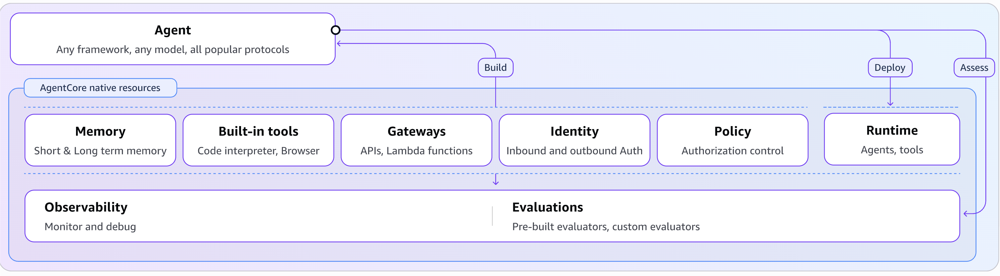
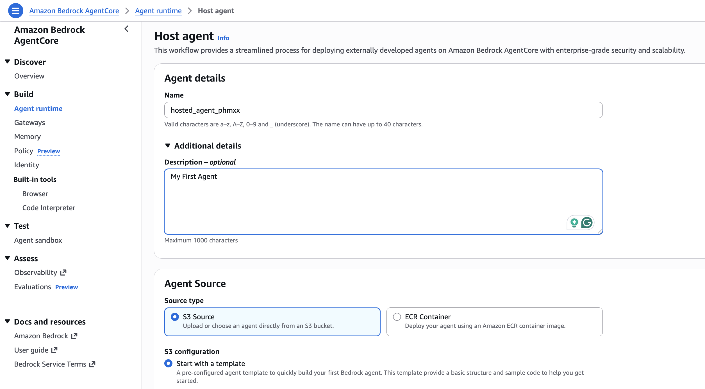
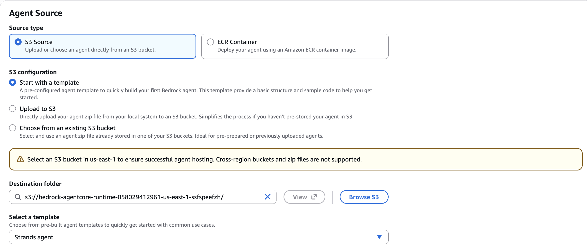
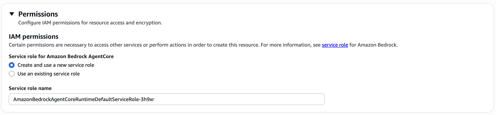
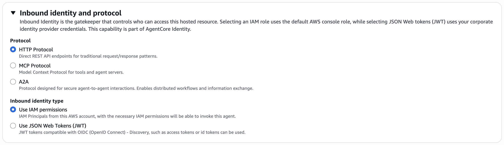
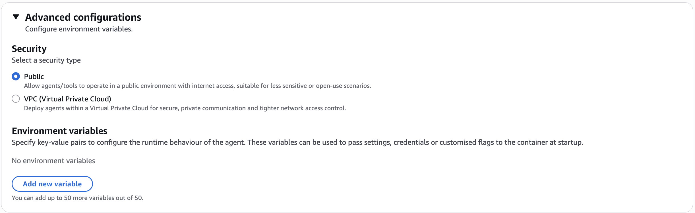
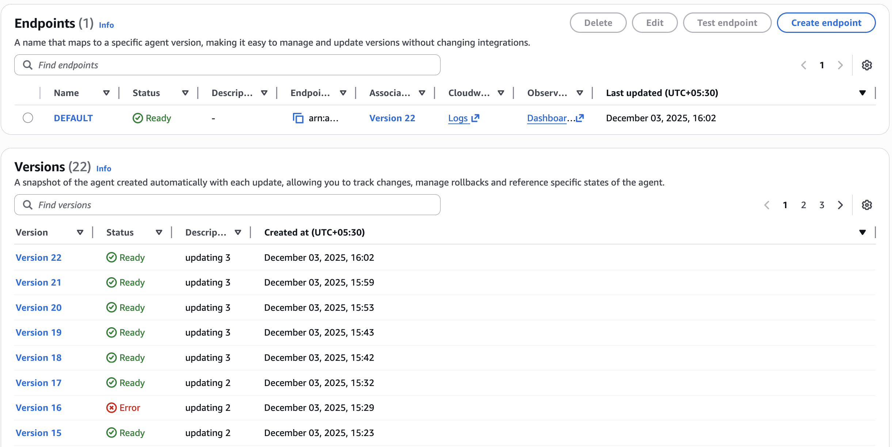

# AWS Bedrock AgentCore Runtime: Building and Deploying AI Agents at Scale



## 🚀 Introduction

AWS Bedrock AgentCore Runtime represents a revolutionary approach to deploying and managing AI agents in the cloud. This comprehensive guide walks you through building, deploying, and invoking AI agents using AWS's fully managed AgentCore service, eliminating the complexity of infrastructure management while providing enterprise-grade scalability and security.

In this blog-style guide, we'll explore how to create a production-ready AI agent that leverages Claude 3 Haiku through Bedrock, deploy it using automated build scripts, and invoke it seamlessly from your applications or Lambda functions.

## 📋 Table of Contents

- [Architecture Overview](#architecture-overview)
- [Prerequisites](#prerequisites)
- [Project Structure](#project-structure)
- [Core Components](#core-components)
- [Step-by-Step Implementation](#step-by-step-implementation)
- [Deployment Process](#deployment-process)
- [Agent Invocation](#agent-invocation)
- [Best Practices](#best-practices)
- [Troubleshooting](#troubleshooting)
- [Advanced Configuration](#advanced-configuration)

## 🏗️ Architecture Overview

AWS Bedrock AgentCore Runtime provides a serverless, fully managed environment for running AI agents. The architecture consists of several key components:

### High-Level Architecture

The AgentCore Runtime follows a simple yet powerful pattern:

1. **Agent Code**: Your Python application using the Bedrock AgentCore SDK
2. **S3 Storage**: Packaged agent code stored as ZIP files
3. **AgentCore Runtime**: Managed service that hosts and executes your agent
4. **Invocation Layer**: Direct API calls or Lambda integration for triggering agents



### Key Benefits

- **Serverless**: No infrastructure to manage
- **Scalable**: Automatic scaling based on demand
- **Secure**: Built-in AWS security and compliance
- **Cost-Effective**: Pay only for what you use
- **Integrated**: Native integration with Bedrock models

## 🔧 Prerequisites

Before diving into the implementation, ensure you have the following:

### AWS Requirements
- AWS Account with appropriate permissions
- AWS CLI configured with credentials
- Access to Amazon Bedrock service
- S3 bucket for storing agent packages

### Development Environment
- Python 3.13 or higher
- pip package manager
- bash shell (for deployment scripts)
- Git for version control

### Required AWS Permissions
```json
{
    "Version": "2012-10-17",
    "Statement": [
        {
            "Effect": "Allow",
            "Action": [
                "bedrock:*",
                "bedrock-agentcore:*",
                "s3:GetObject",
                "s3:PutObject",
                "s3:ListBucket"
            ],
            "Resource": "*"
        }
    ]
}
```

## 📁 Project Structure

Our AgentCore Runtime project follows a clean, organized structure:

```
aws-agentcore-runtime/
├── main.py                    # Core agent implementation
├── requirements.txt           # Python dependencies
├── script.sh                 # Automated build and deployment script
├── trigger-agent.py          # Agent invocation client
├── images/                   # Documentation screenshots
│   ├── 1-AgentCoreDiagram.png
│   ├── 2-AgentCoreRuntimeHost.png
│   ├── 3-AgentCoreRuntimeHostSource.png
│   ├── 4-AgentCoreRuntimeHostPermission.png
│   ├── 5-AgentCoreRuntimeHostProtocol.png
│   ├── 6-AgentCoreRuntimeHostSecurity.png
│   └── 7-AgentCoreRuntimeEndpoint.png
└── README.md                 # This comprehensive guide
```

## 🧩 Core Components

### 1. Agent Implementation (`main.py`)

The heart of our AI agent is a Python application that leverages the Bedrock AgentCore SDK:

```python
"""AWS Bedrock AgentCore Runtime - AI Agent Implementation"""

import logging
from typing import Dict, Any

from bedrock_agentcore import BedrockAgentCoreApp
from strands import Agent
from strands.models import BedrockModel

# Configure logging
logging.basicConfig(level=logging.INFO)
logger = logging.getLogger(__name__)

# Initialize Bedrock model
bedrock_model = BedrockModel(
    model_id="anthropic.claude-3-haiku-20240307-v1:0",
    region_name="us-east-1",
)

# Initialize app and agent
app = BedrockAgentCoreApp()
agent = Agent(model=bedrock_model)

@app.entrypoint
def invoke(payload: Dict[str, Any]) -> Dict[str, str]:
    """AI agent entrypoint function."""
    try:
        user_message = payload.get("prompt", "Hello! How can I help you today?")
        logger.info(f"Processing request with prompt length: {len(user_message)}")
        
        result = agent(user_message)
        
        logger.info("Successfully processed agent request")
        return {"result": result.message}
        
    except Exception as e:
        logger.error(f"Agent processing failed: {str(e)}")
        return {"result": f"Error processing request: {str(e)}"}

if __name__ == "__main__":
    logger.info("Starting AWS Bedrock AgentCore Runtime")
    app.run()
```

**Key Features:**
- **Error Handling**: Comprehensive exception handling with logging
- **Type Hints**: Full type annotations for better code quality
- **Logging**: Structured logging for debugging and monitoring
- **Flexibility**: Configurable model and region settings

### 2. Dependencies (`requirements.txt`)

Our agent requires specific Python packages:

```
bedrock-agentcore
strands-agents
pydantic
pydantic_core
```

**Package Overview:**
- `bedrock-agentcore`: Core SDK for AgentCore Runtime
- `strands-agents`: Agent framework for building AI applications
- `pydantic`: Data validation and settings management
- `pydantic_core`: Core validation library

### 3. Build and Deployment Script (`script.sh`)

The automated deployment script handles the entire build and upload process:

```bash
#!/bin/bash
set -e

S3_BUCKET=$1
VERSION=$2

if [ -z "$S3_BUCKET" ] || [ -z "$VERSION" ]; then
  echo "Usage: $0 <s3-bucket> <version>"
  exit 1
fi

echo "Building agent version $VERSION for S3 bucket $S3_BUCKET"

# Version normalization
VERSION=$(echo "$VERSION" | tr '[:upper:]' '[:lower:]' | tr ' ' '_' | tr -cd '[:alnum:]-._' | tr '.' '_')

# Clean environment
echo "Cleaning up local files"
rm -f agent.zip
rm -rf package
rm -rf .venv

# Build process
echo "Building agent"
python3 -m venv .venv
source .venv/bin/activate
pip install --upgrade pip --no-cache-dir
pip install -r requirements.txt --no-cache-dir
deactivate

# Package creation
echo "Packaging agent"
mkdir package || true
cp -r .venv/lib/python3.*/site-packages/* package/
cp -r main.py package/
cd package
find . -type f -name '*.py[co]' -delete -o -type d -name __pycache__ -delete
zip -r ../agent.zip *
cd ..

# S3 upload
echo "Uploading agent to S3"
aws s3 cp agent.zip s3://$S3_BUCKET/agent-$VERSION.zip
echo "Agent uploaded to s3://$S3_BUCKET/agent-$VERSION.zip"

# Cleanup
rm -f agent.zip
rm -rf package
rm -rf .venv

echo "Script completed successfully"
```

**Script Features:**
- **Version Management**: Automatic version normalization
- **Clean Builds**: Removes previous artifacts
- **Dependency Isolation**: Uses virtual environments
- **Optimization**: Removes unnecessary files from package
- **Error Handling**: Fails fast on any error

## 🚀 Step-by-Step Implementation

### Step 1: Setting Up the AgentCore Runtime



First, create your AgentCore Runtime in the AWS Console:

1. Navigate to Amazon Bedrock in the AWS Console
2. Select "AgentCore" from the left navigation
3. Click "Create Runtime"
4. Configure the runtime settings:
   - **Name**: Choose a descriptive name
   - **Description**: Document the runtime purpose
   - **Source**: Select "S3" as the source type

### Step 2: Configuring Permissions



Set up the necessary IAM permissions:

1. Create an execution role for the AgentCore Runtime
2. Attach policies for:
   - Bedrock model access
   - S3 bucket access
   - CloudWatch logging
3. Configure the runtime to use this role

### Step 3: Protocol Configuration



Configure the communication protocol:

1. Set the invocation method (HTTP/HTTPS)
2. Configure timeout settings
3. Set up retry policies
4. Define payload format requirements

### Step 4: Security Configuration



Implement security best practices:

1. Enable encryption in transit and at rest
2. Configure VPC settings if required
3. Set up access controls
4. Enable audit logging

### Step 5: Endpoint Configuration



Finalize the endpoint configuration:

1. Review the generated endpoint ARN
2. Configure any custom domains
3. Set up monitoring and alerting
4. Test the endpoint connectivity

## 📦 Deployment Process

### Building and Deploying Your Agent

1. **Prepare Your Environment**
   ```bash
   # Clone or navigate to your project directory
   cd aws-agentcore-runtime
   
   # Ensure AWS CLI is configured
   aws configure list
   ```

2. **Run the Deployment Script**
   ```bash
   # Make the script executable
   chmod +x script.sh
   
   # Deploy your agent
   ./script.sh your-s3-bucket-name v1.0.0
   ```

3. **Monitor the Deployment**
   ```bash
   # Check S3 upload
   aws s3 ls s3://your-s3-bucket-name/
   
   # Verify the agent package
   aws s3 ls s3://your-s3-bucket-name/agent-v1_0_0.zip
   ```

### Deployment Best Practices

- **Version Control**: Always use semantic versioning
- **Testing**: Test in development environments first
- **Rollback Plan**: Keep previous versions for quick rollback
- **Monitoring**: Set up CloudWatch alarms for deployment health

## 🔧 Agent Invocation

### Direct Invocation from Applications

Use the enhanced `trigger-agent.py` for invoking your agent:

```python
"""AWS Bedrock AgentCore Runtime - Agent Invocation Client"""

import json
import logging
from typing import Dict, Any

import boto3
from botocore.exceptions import ClientError

# Configure logging
logging.basicConfig(level=logging.INFO)
logger = logging.getLogger(__name__)

# Configuration
REGION_NAME = 'us-east-1'
AGENT_RUNTIME_ARN = 'arn:aws:bedrock-agentcore:us-east-1:999999999999:runtime/hosted_agent_phmxx-dtrZCGFffv'
RUNTIME_SESSION_ID = 'dfmeoagmreaklgmrkleafremoigrmtesogmtrskhmtkrlshmt'  # Must be 33+ chars
QUALIFIER = "DEFAULT"

def invoke_agent(prompt: str) -> Dict[str, Any]:
    """Invoke the Bedrock AgentCore runtime with a given prompt."""
    try:
        client = boto3.client('bedrock-agentcore', region_name=REGION_NAME)
        payload = json.dumps({"prompt": prompt})
        
        logger.info(f"Invoking agent with prompt length: {len(prompt)}")
        
        response = client.invoke_agent_runtime(
            agentRuntimeArn=AGENT_RUNTIME_ARN,
            runtimeSessionId=RUNTIME_SESSION_ID,
            payload=payload,
            qualifier=QUALIFIER
        )
        
        response_body = response['response'].read()
        response_data = json.loads(response_body)
        
        logger.info("Successfully received agent response")
        return response_data
        
    except ClientError as e:
        logger.error(f"AWS API error: {e}")
        raise
    except json.JSONDecodeError as e:
        logger.error(f"JSON decode error: {e}")
        raise
    except Exception as e:
        logger.error(f"Unexpected error: {e}")
        raise

def main():
    """Main function to demonstrate agent invocation."""
    try:
        prompt = "Explain machine learning in simple terms"
        response_data = invoke_agent(prompt)
        
        print("Agent Response:", response_data)
        
    except Exception as e:
        logger.error(f"Failed to invoke agent: {e}")
        return 1
    
    return 0

if __name__ == "__main__":
    exit(main())
```

### Lambda Integration

For serverless applications, integrate with AWS Lambda:

```python
import json
import boto3
from typing import Dict, Any

def lambda_handler(event: Dict[str, Any], context) -> Dict[str, Any]:
    """Lambda function to invoke AgentCore Runtime."""
    
    client = boto3.client('bedrock-agentcore')
    
    # Extract prompt from event
    prompt = event.get('prompt', 'Hello!')
    
    # Invoke agent
    response = client.invoke_agent_runtime(
        agentRuntimeArn=event['agentRuntimeArn'],
        runtimeSessionId=event.get('sessionId', 'default-session-id-12345678901234567890'),
        payload=json.dumps({"prompt": prompt}),
        qualifier=event.get('qualifier', 'DEFAULT')
    )
    
    # Process response
    response_body = response['response'].read()
    response_data = json.loads(response_body)
    
    return {
        'statusCode': 200,
        'body': json.dumps(response_data)
    }
```

## 🎯 Best Practices

### Code Quality
- **Type Hints**: Use comprehensive type annotations
- **Error Handling**: Implement robust exception handling
- **Logging**: Add structured logging throughout your code
- **Documentation**: Include docstrings for all functions

### Security
- **Credentials**: Never hardcode credentials in your code
- **IAM Roles**: Use least privilege principle for IAM roles
- **Encryption**: Enable encryption for data in transit and at rest
- **Secrets Management**: Use AWS Secrets Manager for sensitive data

### Performance
- **Model Selection**: Choose appropriate Bedrock models for your use case
- **Caching**: Implement response caching where appropriate
- **Timeout Configuration**: Set reasonable timeout values
- **Resource Optimization**: Monitor and optimize resource usage

### Monitoring and Observability
- **CloudWatch Metrics**: Set up custom metrics for your agent
- **Alarms**: Create alarms for error rates and latency
- **Distributed Tracing**: Use AWS X-Ray for request tracing
- **Log Analysis**: Implement log aggregation and analysis

## 🔍 Troubleshooting

### Common Issues and Solutions

#### 1. Agent Deployment Failures
**Problem**: Agent fails to deploy to S3 or AgentCore Runtime
**Solutions**:
- Verify S3 bucket permissions
- Check AWS CLI configuration
- Validate package structure
- Review CloudWatch logs

#### 2. Invocation Errors
**Problem**: Agent invocation returns errors
**Solutions**:
- Verify AgentCore Runtime ARN
- Check session ID format (must be 33+ characters)
- Validate payload structure
- Review IAM permissions

#### 3. Performance Issues
**Problem**: Slow response times or timeouts
**Solutions**:
- Optimize model selection
- Implement request caching
- Adjust timeout configurations
- Monitor resource utilization

#### 4. Authentication Failures
**Problem**: Access denied errors
**Solutions**:
- Verify IAM role permissions
- Check AWS credentials configuration
- Validate resource ARNs
- Review security group settings

### Debugging Tips

1. **Enable Detailed Logging**
   ```python
   import logging
   logging.basicConfig(level=logging.DEBUG)
   ```

2. **Use AWS CLI for Testing**
   ```bash
   aws bedrock-agentcore invoke-agent-runtime \
     --agent-runtime-arn "your-arn" \
     --runtime-session-id "your-session-id" \
     --payload '{"prompt": "test"}'
   ```

3. **Monitor CloudWatch Logs**
   - Check AgentCore Runtime logs
   - Review application logs
   - Monitor error patterns

## ⚙️ Advanced Configuration

### Custom Model Configuration

```python
# Using different Bedrock models
bedrock_model = BedrockModel(
    model_id="anthropic.claude-3-sonnet-20240229-v1:0",  # More powerful model
    region_name="us-west-2",
    model_kwargs={
        "max_tokens": 1000,
        "temperature": 0.7,
        "top_p": 0.9
    }
)
```

### Multi-Region Deployment

```bash
# Deploy to multiple regions
regions=("us-east-1" "us-west-2" "eu-west-1")

for region in "${regions[@]}"; do
    echo "Deploying to $region"
    aws s3 cp agent.zip s3://your-bucket-$region/agent-v1.0.0.zip --region $region
done
```

### Environment-Specific Configuration

```python
import os
from typing import Dict, Any

class AgentConfig:
    """Configuration management for different environments."""
    
    def __init__(self):
        self.environment = os.getenv('ENVIRONMENT', 'development')
        self.config = self._load_config()
    
    def _load_config(self) -> Dict[str, Any]:
        configs = {
            'development': {
                'model_id': 'anthropic.claude-3-haiku-20240307-v1:0',
                'region': 'us-east-1',
                'log_level': 'DEBUG'
            },
            'production': {
                'model_id': 'anthropic.claude-3-sonnet-20240229-v1:0',
                'region': 'us-east-1',
                'log_level': 'INFO'
            }
        }
        return configs.get(self.environment, configs['development'])
```

## 📊 Monitoring and Metrics

### Custom CloudWatch Metrics

```python
import boto3
from datetime import datetime

def publish_custom_metrics(metric_name: str, value: float, unit: str = 'Count'):
    """Publish custom metrics to CloudWatch."""
    cloudwatch = boto3.client('cloudwatch')
    
    cloudwatch.put_metric_data(
        Namespace='AgentCore/Runtime',
        MetricData=[
            {
                'MetricName': metric_name,
                'Value': value,
                'Unit': unit,
                'Timestamp': datetime.utcnow()
            }
        ]
    )

# Usage in your agent
@app.entrypoint
def invoke(payload: Dict[str, Any]) -> Dict[str, str]:
    start_time = time.time()
    
    try:
        # Your agent logic here
        result = agent(user_message)
        
        # Publish success metric
        publish_custom_metrics('AgentInvocations', 1, 'Count')
        publish_custom_metrics('ResponseTime', time.time() - start_time, 'Seconds')
        
        return {"result": result.message}
        
    except Exception as e:
        # Publish error metric
        publish_custom_metrics('AgentErrors', 1, 'Count')
        raise
```

## 🚀 Scaling and Optimization

### Performance Optimization Strategies

1. **Model Selection**: Choose the right model for your use case
   - Haiku: Fast, cost-effective for simple tasks
   - Sonnet: Balanced performance and capability
   - Opus: Maximum capability for complex tasks

2. **Caching Strategy**: Implement intelligent caching
   ```python
   from functools import lru_cache
   
   @lru_cache(maxsize=100)
   def cached_agent_response(prompt_hash: str) -> str:
       # Cache responses for identical prompts
       pass
   ```

3. **Batch Processing**: Process multiple requests efficiently
   ```python
   def batch_invoke(prompts: List[str]) -> List[Dict[str, str]]:
       """Process multiple prompts in batch."""
       results = []
       for prompt in prompts:
           result = agent(prompt)
           results.append({"result": result.message})
       return results
   ```

## 🔐 Security Considerations

### Data Privacy and Compliance

1. **Data Encryption**: Ensure all data is encrypted
2. **Access Controls**: Implement fine-grained access controls
3. **Audit Logging**: Enable comprehensive audit logging
4. **Compliance**: Follow industry-specific compliance requirements

### Security Best Practices

```python
import hashlib
import hmac
from typing import Optional

class SecurityManager:
    """Security utilities for agent operations."""
    
    def __init__(self, secret_key: str):
        self.secret_key = secret_key
    
    def validate_request(self, payload: str, signature: str) -> bool:
        """Validate request signature."""
        expected_signature = hmac.new(
            self.secret_key.encode(),
            payload.encode(),
            hashlib.sha256
        ).hexdigest()
        
        return hmac.compare_digest(signature, expected_signature)
    
    def sanitize_input(self, user_input: str) -> str:
        """Sanitize user input to prevent injection attacks."""
        # Implement input sanitization logic
        return user_input.strip()
```

## 📈 Cost Optimization

### Cost Management Strategies

1. **Model Selection**: Choose cost-effective models
2. **Request Optimization**: Minimize unnecessary requests
3. **Caching**: Implement response caching
4. **Monitoring**: Track usage and costs

### Cost Monitoring

```python
def calculate_estimated_cost(tokens_used: int, model_id: str) -> float:
    """Calculate estimated cost based on token usage."""
    
    # Pricing per 1K tokens (example rates)
    pricing = {
        'anthropic.claude-3-haiku-20240307-v1:0': 0.00025,
        'anthropic.claude-3-sonnet-20240229-v1:0': 0.003,
        'anthropic.claude-3-opus-20240229-v1:0': 0.015
    }
    
    rate = pricing.get(model_id, 0.001)
    return (tokens_used / 1000) * rate
```

## 🎯 Conclusion

AWS Bedrock AgentCore Runtime provides a powerful, scalable platform for deploying AI agents in production environments. By following the practices and patterns outlined in this guide, you can build robust, secure, and efficient AI agents that scale with your business needs.

### Key Takeaways

1. **Simplicity**: AgentCore Runtime eliminates infrastructure complexity
2. **Scalability**: Automatic scaling handles varying workloads
3. **Security**: Built-in AWS security features protect your agents
4. **Cost-Effectiveness**: Pay-per-use model optimizes costs
5. **Integration**: Seamless integration with AWS services

### Next Steps

1. **Experiment**: Try different Bedrock models for your use cases
2. **Optimize**: Implement caching and performance optimizations
3. **Monitor**: Set up comprehensive monitoring and alerting
4. **Scale**: Deploy across multiple regions for global availability
5. **Innovate**: Explore advanced agent capabilities and integrations

### Resources

- [AWS Bedrock Documentation](https://docs.aws.amazon.com/bedrock/)
- [AgentCore Runtime API Reference](https://docs.aws.amazon.com/bedrock/latest/APIReference/)
- [Bedrock Model Documentation](https://docs.aws.amazon.com/bedrock/latest/userguide/models-supported.html)
- [AWS Security Best Practices](https://aws.amazon.com/security/security-learning/)

---

**Ready to build your next AI agent?** Start with this foundation and customize it for your specific use case. The future of AI applications is serverless, scalable, and secure with AWS Bedrock AgentCore Runtime.