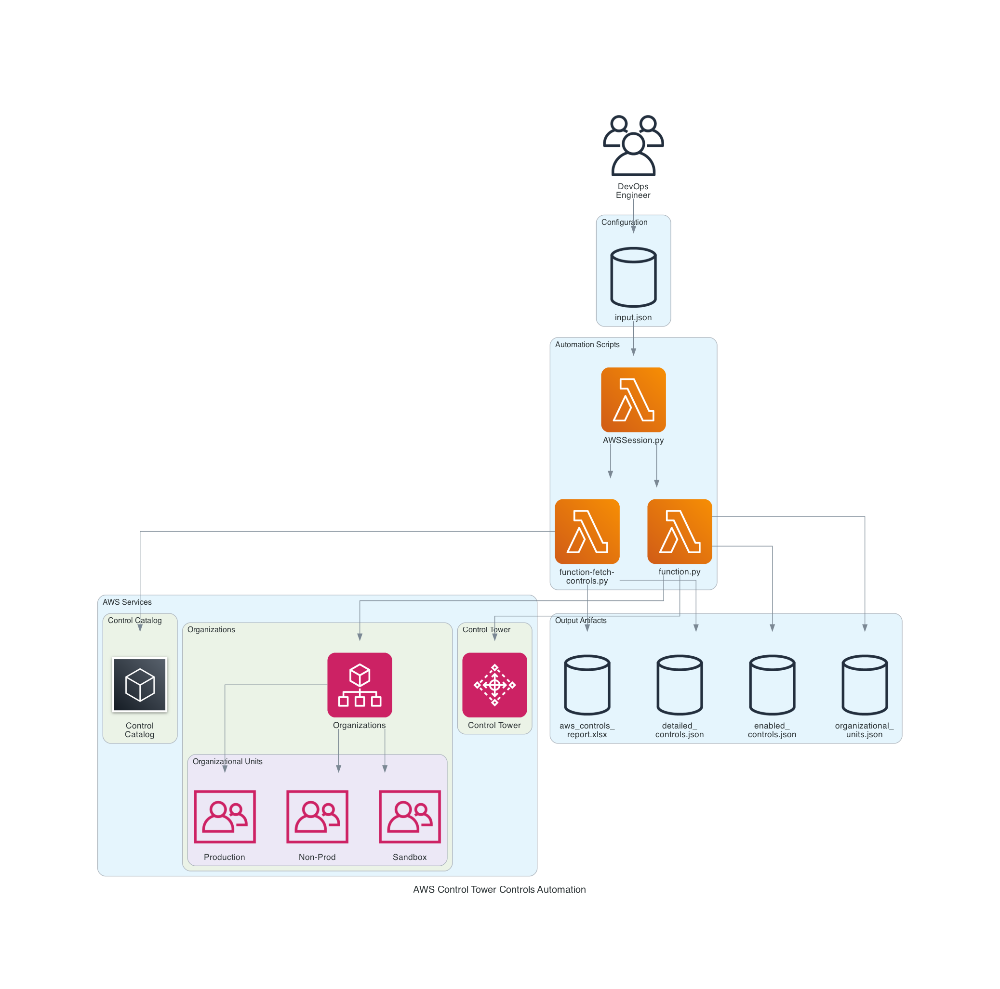

# Automating AWS Control Tower Controls at Scale: A Centralized Governance Approach

## Introduction & Problem Statement

In multi-account AWS environments managed by AWS Control Tower, maintaining consistent security and compliance posture across organizational units (OUs) is a critical challenge. Organizations often struggle with:

- **Manual Control Enablement**: Enabling controls across multiple OUs is time-consuming and error-prone
- **Lack of Visibility**: No centralized view of available controls and their configurations
- **Inconsistent Governance**: Different OUs may have different control configurations
- **Audit Complexity**: Tracking which controls are enabled where becomes difficult at scale

AWS Control Tower provides guardrails (controls) to enforce policies, but enabling them manually through the console doesn't scale. When you need to enable 50+ detective and preventive controls across 10+ organizational units, automation becomes essential.

This solution provides a **centralized, declarative approach** to manage AWS Control Tower controls using Python and the AWS Control Catalog API. It enables DevOps and Platform teams to:

1. Discover all available controls with detailed metadata
2. Enable controls programmatically across multiple OUs
3. Track control enablement status
4. Generate comprehensive Excel reports for audit and planning

## Architecture / Design Overview

The solution consists of two primary components working with AWS Control Tower and Control Catalog APIs:



```
                    ┌─────────────────────┐
                    │  DevOps Engineer    │
                    └──────────┬──────────┘
                               │
                               ▼
                    ┌─────────────────────┐
                    │    input.json       │
                    │  (Configuration)    │
                    └──────────┬──────────┘
                               │
                               ▼
                    ┌─────────────────────┐
                    │   AWSSession.py     │
                    │  (Authentication)   │
                    └──────┬──────┬───────┘
                           │      │
              ┌────────────┘      └────────────┐
              ▼                                ▼
   ┌──────────────────────┐        ┌──────────────────────┐
   │ function-fetch-      │        │    function.py       │
   │   controls.py        │        │  (Enable Controls)   │
   │ (Discover Controls)  │        └──────────┬───────────┘
   └──────┬───────────────┘                   │
          │                                   │
          ▼                                   ▼
   ┌──────────────────────┐        ┌──────────────────────┐
   │  Control Catalog     │        │   Control Tower      │
   │  (AWS Service)       │        │   (AWS Service)      │
   └──────┬───────────────┘        └──────────┬───────────┘
          │                                   │
          │                                   ▼
          │                        ┌──────────────────────┐
          │                        │   Organizations      │
          │                        │   (AWS Service)      │
          │                        └──────────┬───────────┘
          │                                   │
          │                        ┌──────────┴───────────┐
          │                        │                      │
          │                        ▼                      ▼
          │             ┌─────────────────┐   ┌─────────────────┐
          │             │  OU: Production │   │  OU: Non-Prod   │
          │             └─────────────────┘   └─────────────────┘
          │                        │
          │                        ▼
          │             ┌─────────────────┐
          │             │  OU: Sandbox    │
          │             └─────────────────┘
          │
          ▼
   ┌──────────────────────────────────────────────────────┐
   │              Output Artifacts                         │
   │                                                       │
   │  • aws_controls_report.xlsx (Excel Report)           │
   │  • detailed_controls.json (All Controls)             │
   │  • enabled_controls.json (Current State)             │
   │  • organizational_units.json (OU Hierarchy)          │
   └──────────────────────────────────────────────────────┘
```

### Key Components

1. **Control Discovery Engine** (`function-fetch-controls.py`): Fetches all available controls from AWS Control Catalog
2. **Control Enablement Engine** (`function.py`): Enables controls on target OUs based on configuration
3. **Configuration Management** (`input.json`): Declarative control definitions
4. **AWS Session Manager** (`AWSSession.py`): Flexible authentication handler

## Solution Approach

### Phase 1: Discovery
Before enabling controls, you need to understand what's available. The solution fetches:
- All controls from AWS Control Catalog (1000+ controls)
- Control metadata (behavior, severity, implementation type)
- Related and common control mappings
- Regional availability and governed resources

### Phase 2: Planning
Using the generated Excel report, teams can:
- Filter controls by behavior (DETECTIVE, PREVENTIVE, PROACTIVE)
- Identify controls by severity (CRITICAL, HIGH, MEDIUM, LOW)
- Review implementation requirements
- Plan phased rollout strategies

### Phase 3: Enablement
The automation:
- Reads declarative configuration from `input.json`
- Checks current enablement status to avoid duplicates
- Enables controls across specified OUs
- Tracks operation status and logs progress

### Phase 4: Validation
Post-enablement verification:
- Lists all enabled controls per OU
- Exports current state to JSON
- Provides audit trail for compliance

## Code Walkthrough

### 1. AWS Session Management (`AWSSession.py`)

The solution supports multiple authentication methods for flexibility across environments:

```python
def get_aws_session(credentials: Dict[str, Any]) -> boto3.Session:
    """Create AWS session with flexible authentication methods."""
    region = credentials.get("region_name", "us-east-1")
    
    if credentials.get("profile_name"):
        return boto3.Session(profile_name=credentials["profile_name"], region_name=region)
    elif credentials.get("role_arn"):
        return _create_assumed_role_session(credentials["role_arn"], region)
    elif credentials.get("key_session_token"):
        return boto3.Session(
            aws_access_key_id=credentials["access_key"],
            aws_secret_access_key=credentials["secret_access_key"],
            aws_session_token=credentials["key_session_token"],
            region_name=region
        )
    # ... additional methods
```

**Why this matters**: Different environments require different authentication patterns. CI/CD pipelines use IAM roles, local development uses profiles, and cross-account access uses assumed roles.

### 2. Control Discovery (`function-fetch-controls.py`)

The discovery engine performs comprehensive data collection:

```python
def fetch_all_controls(input_file: str = "input.json") -> List[Dict[str, Any]]:
    """Fetch all controls from AWS Control Catalog and generate Excel report."""
    
    # Paginate through all controls
    controls = []
    next_token = None
    while True:
        params = {'MaxResults': max_results}
        if next_token:
            params['NextToken'] = next_token
        response = client.list_controls(**params)
        controls.extend(response['Controls'])
        next_token = response.get('NextToken')
        if not next_token:
            break
    
    # Enrich with detailed information
    for control in controls:
        detail = client.get_control(ControlArn=control['Arn'])
        # Fetch related controls and common control mappings
        # ...
```

**Key insight**: The AWS Control Catalog contains over 1000 controls. Pagination is essential, and enriching each control with detailed metadata provides the context needed for decision-making.

### 3. Control Enablement (`function.py`)

The enablement logic implements idempotent operations:

```python
def enable_controls(client, config: Dict[str, Any], controls_by_ou: Dict[str, List[Dict[str, Any]]]):
    """Enable controls on target organizational units."""
    
    for behavior, behavior_config in enable_config.items():
        target_identifiers = behavior_config.get("targetIdentifiers", ...)
        control_identifiers = behavior_config["controlIdentifiers"]
        
        for target in target_identifiers:
            for control_config in control_identifiers:
                # Check if already enabled
                is_enabled = False
                if target_id in controls_by_ou:
                    for enabled_control in controls_by_ou[target_id]:
                        if enabled_control['controlIdentifier'] == control_arn:
                            is_enabled = True
                            break
                
                if not is_enabled:
                    response = client.enable_control(
                        controlIdentifier=control_arn,
                        targetIdentifier=target_arn
                    )
```

**Critical design decision**: Always check current state before enabling. Control Tower operations are asynchronous and can take minutes. Duplicate requests cause failures.

### 4. Excel Report Generation

The solution generates multi-sheet Excel reports with dynamic severity columns:

```python
def generate_excel_report(controls: List[Dict[str, Any]], common_controls: List[Dict[str, Any]]):
    """Generate Excel report for controls."""
    
    # Get unique severities dynamically
    unique_severities = sorted(set(control.get('Severity', '') for control in controls))
    
    # Group by behavior
    behavior_groups = {}
    for control in controls:
        behavior = control.get('Behavior', 'Unknown')
        if behavior not in behavior_groups:
            behavior_groups[behavior] = []
        behavior_groups[behavior].append(control)
    
    # Create summary and behavior-specific sheets
    # ...
```

**Why Excel?**: While JSON is machine-readable, Excel provides filtering, sorting, and pivot capabilities that make it ideal for planning and stakeholder communication.

## Configuration & Setup Instructions

### Prerequisites

- Python 3.13+
- AWS CLI configured with appropriate credentials
- IAM permissions for Control Tower and Control Catalog APIs
- Access to AWS Organizations

### Required IAM Permissions

```json
{
  "Version": "2012-10-17",
  "Statement": [
    {
      "Effect": "Allow",
      "Action": [
        "controltower:ListEnabledControls",
        "controltower:EnableControl",
        "controltower:GetControlOperation",
        "controlcatalog:ListControls",
        "controlcatalog:GetControl",
        "controlcatalog:ListControlMappings",
        "controlcatalog:ListDomains",
        "controlcatalog:ListObjectives",
        "controlcatalog:ListCommonControls",
        "organizations:ListOrganizationalUnitsForParent",
        "organizations:ListRoots"
      ],
      "Resource": "*"
    }
  ]
}
```

### Installation

```bash
# Clone repository
cd aws-control-tower-controls

# Create virtual environment
python3 -m venv venv
source venv/bin/activate  # On Windows: venv\Scripts\activate

# Install dependencies
pip install -r requirements.txt
```

### Configuration

1. **Copy and customize input.json**:

```json
{
  "awsCredentials": {
    "region_name": "us-east-1",
    "profile_name": "your-profile"
  },
  "controlTower": {
    "organizationalUnits": [
      {
        "Id": "ou-xxxx-xxxxxxxx",
        "Arn": "arn:aws:organizations::123456789012:ou/o-xxxxxx/ou-xxxx-xxxxxxxx",
        "Name": "Production"
      }
    ],
    "enableControls": {
      "DETECTIVE": {
        "controlIdentifiers": [
          {
            "Arn": "arn:aws:controlcatalog:::control/xxxxx",
            "Name": "Control Name",
            "Severity": "HIGH"
          }
        ]
      }
    }
  }
}
```

2. **Discover available controls**:

```bash
python function-fetch-controls.py
```

This generates:
- `aws_controls_report.xlsx` - Comprehensive Excel report
- `detailed_controls.json` - All controls with metadata

3. **Review and select controls** from the Excel report

4. **Update input.json** with selected controls

5. **Enable controls**:

```bash
python function.py
```

## Usage Examples

### Example 1: Discover All Available Controls

```bash
# Run discovery
python function-fetch-controls.py

# Output files created:
# - aws_controls_report.xlsx (multi-sheet report)
# - detailed_controls.json (raw data)
```

The Excel report contains:
- **Summary sheet**: Control counts by behavior and severity
- **Controls sheet**: All controls with full details
- **Common Controls sheet**: Framework mappings
- **Behavior-specific sheets**: DETECTIVE, PREVENTIVE, PROACTIVE

### Example 2: Enable Critical Security Controls

Update `input.json`:

```json
{
  "controlTower": {
    "enableControls": {
      "DETECTIVE": {
        "controlIdentifiers": [
          {
            "Arn": "arn:aws:controlcatalog:::control/df2ta5ytg2zatj1q7y5e09u32",
            "Name": "Disallow Internet connection via RDP",
            "Severity": "CRITICAL"
          },
          {
            "Arn": "arn:aws:controlcatalog:::control/1h4eyqyyonp19dlrreqf1i3w0",
            "Name": "Disallow public access to RDS database snapshots",
            "Severity": "CRITICAL"
          }
        ]
      }
    }
  }
}
```

Run enablement:

```bash
python function.py
```

### Example 3: Enable Preventive Controls for EBS Snapshots

```json
{
  "controlTower": {
    "enableControls": {
      "PREVENTIVE": {
        "targetIdentifiers": [
          {
            "Id": "ou-xxxx-prod",
            "Arn": "arn:aws:organizations::123456789012:ou/o-xxx/ou-xxxx-prod"
          }
        ],
        "controlIdentifiers": [
          {
            "Arn": "arn:aws:controlcatalog:::control/ek6wc2bmgzmho1kk6bn236mqt",
            "Name": "Disallow all public sharing of Amazon EBS snapshots"
          }
        ]
      }
    }
  }
}
```

### Example 4: Automated Execution via Shell Script

```bash
#!/bin/bash
./script.sh
```

The script handles:
- Virtual environment creation
- Dependency installation
- Script execution
- Cleanup

## Best Practices Followed

### 1. Idempotent Operations
Always check if a control is already enabled before attempting enablement. This prevents duplicate operations and API throttling.

### 2. Pagination Handling
AWS APIs return paginated results. The solution properly handles `NextToken` for all list operations.

### 3. Comprehensive Logging
Structured logging with timestamps and log levels enables troubleshooting and audit trails:

```python
logging.basicConfig(
    level=logging.INFO,
    format='%(asctime)s - %(name)s - %(levelname)s - %(message)s'
)
```

### 4. Flexible Authentication
Supporting multiple authentication methods (profiles, roles, keys, STS) ensures the solution works across different environments.

### 5. Declarative Configuration
Using JSON configuration separates data from code, making it easy to version control and review changes.

### 6. Error Handling
Graceful error handling with try-except blocks ensures partial failures don't break the entire process:

```python
try:
    response = client.enable_control(...)
    logger.info(f"Successfully enabled control: {response['operationIdentifier']}")
except Exception as e:
    logger.error(f"Failed to enable control: {str(e)}")
```

### 7. Data Enrichment
Fetching detailed control information from Control Catalog provides context for decision-making.

## Security & Performance Considerations

### Security

1. **Credential Management**
   - Never commit actual credentials to version control
   - Use placeholder values in `input.json`
   - Leverage AWS IAM roles in production environments
   - Consider AWS Secrets Manager for sensitive data

2. **Least Privilege Access**
   - Grant only required IAM permissions
   - Use separate roles for discovery vs. enablement
   - Implement SCPs to prevent unauthorized control modifications

3. **Audit Trail**
   - All operations are logged with timestamps
   - Output files provide state snapshots
   - Control Tower maintains its own audit logs in CloudTrail

### Performance

1. **API Rate Limiting**
   - AWS Control Catalog and Control Tower APIs have rate limits
   - The solution uses `MaxResults=100` for optimal pagination
   - Implement exponential backoff for production use

2. **Asynchronous Operations**
   - Control enablement is asynchronous (can take 5-10 minutes)
   - The solution returns operation identifiers for tracking
   - Consider implementing polling for operation status

3. **Batch Processing**
   - Enable controls in batches by behavior type
   - Process multiple OUs sequentially to avoid conflicts
   - Monitor AWS Service Quotas for concurrent operations

4. **Data Volume**
   - Control Catalog contains 1000+ controls
   - Excel generation can take 2-3 minutes
   - JSON files are typically 1-5 MB

## Common Pitfalls & Troubleshooting

### Issue 1: "Control already enabled" Error

**Symptom**: API returns error when enabling a control

**Cause**: Control is already enabled on the target OU

**Solution**: The solution checks enablement status before attempting to enable. Ensure you're running the latest version.

### Issue 2: Pagination Not Working

**Symptom**: Only 100 controls returned

**Cause**: Not handling `NextToken` properly

**Solution**: Verify the while loop continues until `NextToken` is None:

```python
while True:
    response = client.list_controls(**params)
    controls.extend(response['Controls'])
    next_token = response.get('NextToken')
    if not next_token:
        break
```

### Issue 3: Authentication Failures

**Symptom**: `NoCredentialsError` or `AccessDenied`

**Cause**: Invalid or insufficient credentials

**Solution**:
- Verify AWS CLI configuration: `aws sts get-caller-identity`
- Check IAM permissions match required policy
- Ensure profile name in `input.json` matches AWS config

### Issue 4: Empty Excel Report

**Symptom**: Excel file created but sheets are empty

**Cause**: API returned no controls or filtering removed all results

**Solution**:
- Check AWS region supports Control Catalog
- Verify IAM permissions include `controlcatalog:ListControls`
- Review logs for API errors

### Issue 5: Slow Performance

**Symptom**: Script takes 10+ minutes to complete

**Cause**: Fetching detailed information for 1000+ controls

**Solution**:
- This is expected behavior for full discovery
- Consider caching results and running discovery weekly
- For enablement only, use `function.py` which is faster

## Enhancements & Future Improvements

### Short-term Enhancements

1. **Operation Status Polling**
   ```python
   def wait_for_control_enablement(client, operation_id, timeout=600):
       """Poll operation status until complete or timeout."""
       start_time = time.time()
       while time.time() - start_time < timeout:
           response = client.get_control_operation(operationIdentifier=operation_id)
           if response['controlOperation']['status'] in ['SUCCEEDED', 'FAILED']:
               return response
           time.sleep(30)
   ```

2. **Dry-run Mode**
   - Add `--dry-run` flag to preview changes without applying
   - Generate diff report showing what would be enabled

3. **Email Notifications**
   - Leverage existing SMTP configuration in `input.json`
   - Send summary reports after enablement completes

### Medium-term Enhancements

1. **Control Drift Detection**
   - Compare current state vs. desired state
   - Alert on manual changes outside automation

2. **Rollback Capability**
   - Disable controls that were enabled by mistake
   - Maintain state history for rollback

3. **Terraform/CloudFormation Integration**
   - Export configuration as IaC templates
   - Enable GitOps workflows

### Long-term Vision

1. **Web Dashboard**
   - Visual interface for control management
   - Real-time status monitoring
   - Approval workflows for control changes

2. **Policy-as-Code Framework**
   - Define compliance frameworks (CIS, PCI-DSS, HIPAA)
   - Map controls to framework requirements
   - Automated compliance reporting

3. **Multi-region Support**
   - Manage controls across multiple AWS regions
   - Handle regional control availability

4. **Integration with AWS Security Hub**
   - Correlate control findings with Security Hub
   - Unified security posture view

## Conclusion

Managing AWS Control Tower controls at scale requires automation. This solution provides a production-ready framework for:

- **Discovery**: Understanding what controls are available
- **Planning**: Making informed decisions using comprehensive reports
- **Enablement**: Applying controls consistently across OUs
- **Validation**: Tracking and auditing control status

### Key Takeaways

1. **Declarative configuration** makes control management predictable and version-controllable
2. **Idempotent operations** ensure safe re-runs without side effects
3. **Comprehensive reporting** bridges the gap between technical implementation and business requirements
4. **Flexible authentication** supports diverse deployment scenarios

### Getting Started Checklist

- [ ] Install dependencies and configure AWS credentials
- [ ] Run `function-fetch-controls.py` to discover available controls
- [ ] Review `aws_controls_report.xlsx` and select controls
- [ ] Update `input.json` with selected controls and target OUs
- [ ] Run `function.py` to enable controls
- [ ] Verify enablement in AWS Control Tower console
- [ ] Schedule periodic discovery runs to catch new controls

### Resources

- [AWS Control Tower Documentation](https://docs.aws.amazon.com/controltower/)
- [Control Tower Best Practices](https://docs.aws.amazon.com/controltower/latest/userguide/best-practices.html)

---

## Contact & Support

**Author**: Prashant Gupta  
**GitHub**: https://github.com/prashantgupta123/  
**LinkedIn**: https://www.linkedin.com/in/prashantgupta123/

**Questions or feedback?** Open an issue or submit a pull request!

---

*This solution is part of the [DevOps Automation Solutions](https://github.com/prashantgupta123/devops-automation) repository—a comprehensive collection of production-ready automation tools for cloud infrastructure management.*

**⭐ If you found this helpful, please star the repository!**

---