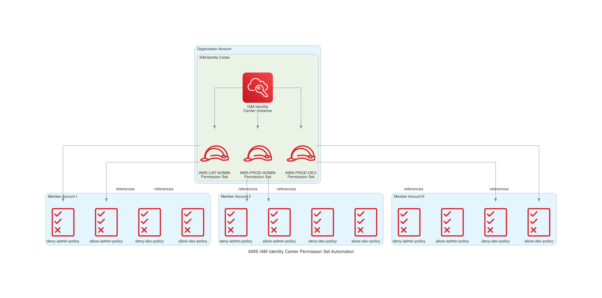

# AWS IAM Identity Center Permission Set Automation

## Introduction & Problem Statement

Managing access control across multiple AWS accounts in an organization presents significant operational challenges. Traditional IAM user management becomes unwieldy as teams grow, requiring manual user creation, credential rotation, and permission management across dozens or hundreds of accounts. This approach is error-prone, time-consuming, and creates security risks through credential sprawl.

AWS IAM Identity Center (formerly AWS SSO) offers a centralized identity management solution, but setting it up consistently across multiple accounts with standardized permission sets and custom policies remains a manual, repetitive task. Organizations need:

- **Consistent Permission Models**: Standardized access levels (Admin, Developer, ReadOnly) across all accounts
- **Custom Policy Enforcement**: Organization-specific security guardrails that prevent risky actions
- **Multi-Account Scalability**: Ability to deploy policies to dozens of member accounts efficiently
- **Audit & Compliance**: Centralized tracking of who has access to what resources
- **Separation of Concerns**: Different permission boundaries for production vs non-production environments

This automation solution addresses these challenges by providing a declarative, configuration-driven approach to creating IAM Identity Center permission sets and deploying custom IAM policies across multiple AWS accounts simultaneously.

## Architecture / Design Overview

The solution follows a hub-and-spoke architecture model:



**Key Design Principles:**

1. **Centralized Control**: Permission sets are created in the organization account's IAM Identity Center
2. **Distributed Policies**: Customer-managed IAM policies are deployed to each member account
3. **Policy Layering**: Combines AWS managed policies, customer managed policies, and inline policies
4. **Idempotent Operations**: Safe to run multiple times without creating duplicates
5. **Configuration-Driven**: All settings defined in JSON configuration files

## Solution Approach

The automation follows a two-phase deployment strategy:

### Phase 1: IAM Policy Deployment (Member Accounts)

For each member account defined in `account_details.json`:
1. Authenticate using flexible credential methods (profile, role assumption, access keys)
2. Check if each policy already exists to avoid duplicates
3. Create customer-managed IAM policies from JSON policy documents
4. Apply consistent tagging for resource management

### Phase 2: Permission Set Creation (Organization Account)

In the organization account:
1. Authenticate to the organization account using credentials from `input.json`
2. Retrieve the IAM Identity Center instance ARN
3. Create permission sets with specified session durations
4. Attach AWS managed policies (e.g., ReadOnlyAccess)
5. Reference customer-managed policies created in Phase 1
6. Optionally attach inline policies for additional customization

### Policy Architecture Pattern

The solution implements a **deny-by-default with explicit allow** pattern:

- **Deny Policies**: Block dangerous operations (e.g., deleting security services, modifying IAM Identity Center)
- **Allow Policies**: Grant specific permissions needed for the role (e.g., EC2 management, CodePipeline access)
- **AWS Managed Policies**: Provide baseline read access across all services

This layered approach ensures security guardrails are always enforced while providing necessary operational access.

## Code Walkthrough

### Core Components

#### 1. AWSSession.py - Flexible Authentication Module

Provides multiple authentication methods to support different deployment scenarios:

```python
def get_aws_session(credentials: Dict[str, Any]) -> boto3.Session
```

Supports:
- **Profile-based**: Uses AWS CLI profiles for local development
- **Role assumption**: Assumes cross-account roles for automated deployments
- **Temporary credentials**: Uses STS session tokens
- **Access keys**: Direct credential authentication
- **Default chain**: Falls back to instance profiles or environment variables

#### 2. function.py - Main Orchestration Logic

**load_config_files()**: Loads configuration from JSON files

**create_iam_policy_if_not_exists()**: 
- Checks if policy exists using `get_policy()` API call
- Creates policy from JSON document if not found
- Applies tags for resource tracking
- Returns policy ARN for reference

**get_sso_instance_arn()**:
- Retrieves IAM Identity Center instance ARN
- Validates single instance exists (prevents ambiguity)
- Logs Identity Store ID for reference

**create_permission_set_if_not_exists()**:
- Paginates through existing permission sets to check for duplicates
- Creates new permission set with session duration
- Attaches AWS managed policies by ARN
- References customer managed policies by name
- Optionally adds inline policies for fine-grained control

**create_iam_identity_center_resources()**:
- Main orchestration function
- Processes member accounts first (policies must exist before referencing)
- Then creates permission sets in organization account
- Comprehensive logging at each step

#### 3. Notification.py - Email Reporting Module

Provides email notification capabilities for automation reports:
- SMTP integration with TLS support
- HTML email formatting
- Multi-recipient support (To, CC, BCC)
- File attachment handling

## Configuration & Setup Instructions

### Prerequisites

1. **AWS Organization Setup**: IAM Identity Center enabled in organization account
2. **Python Environment**: Python 3.13+ with boto3 installed
3. **AWS Credentials**: Appropriate access to organization and member accounts
4. **Permissions Required**:
   - Organization Account: `sso-admin:*`, `identitystore:ListInstances`
   - Member Accounts: `iam:CreatePolicy`, `iam:GetPolicy`, `iam:TagPolicy`

### Step 1: Configure Member Accounts

Edit `account_details.json` with your member account details:

```json
[
    {
        "cloudName": "AWS",
        "regionName": "ap-south-1",
        "projectName": "Production",
        "accountId": "123456789012",
        "accountName": "prod-account",
        "roleName": "OrganizationAccountAccessRole",
        "accountKeys": {
            "profile_name": "prod-profile",
            "role_arn": "",
            "access_key": "",
            "secret_access_key": "",
            "key_session_token": ""
        }
    }
]
```

**Authentication Options** (choose one per account):
- Set `profile_name` for AWS CLI profile authentication
- Set `role_arn` for cross-account role assumption
- Set `access_key`, `secret_access_key`, and optionally `key_session_token` for direct credentials
- Leave all empty to use default credential chain

### Step 2: Configure Organization Account & Permission Sets

Edit `input.json`:

```json
{
    "awsCredentials": {
        "account_id": "999888777666",
        "account_name": "org-master",
        "region_name": "us-east-1",
        "profile_name": "org-profile"
    },
    "defaultTags": {
        "Environment": "ALL",
        "Project": "IAM-Automation",
        "Owner": "DevOps Team"
    },
    "defaultIAMPolicy": {
        "deny-admin-policy": {
            "policy_name": "iam-identity-center-deny-admin-policy",
            "description": "Deny administrative and sensitive actions",
            "policy_file": "deny-admin-policy.json"
        }
    },
    "permissionSetConfig": {
        "AWS-PROD-ADMIN": {
            "permission_set_name": "AWS-PROD-ADMIN",
            "description": "Administrator Access for Production",
            "session_duration": "PT8H",
            "aws_managed_policies": ["ReadOnlyAccess"],
            "customer_managed_policies": [
                "iam-identity-center-deny-admin-policy",
                "iam-identity-center-allow-admin-policy"
            ],
            "inline_policy": ""
        }
    }
}
```

### Step 3: Customize Policy Documents

Create or modify policy JSON files in the `policy/` directory:

- `deny-admin-policy.json`: Security guardrails for admin users
- `allow-admin-policy.json`: Permitted admin operations
- `deny-developer-policy.json`: Security guardrails for developers
- `allow-developer-policy.json`: Permitted developer operations

### Step 4: Execute the Automation

Run the deployment script:

```bash
chmod +x script.sh
./script.sh
```

Or run Python directly:

```bash
python3 -m venv venv
source venv/bin/activate
pip install boto3
python function.py
```

### Step 5: Verify Deployment

1. **Check IAM Policies**: Log into each member account → IAM → Policies → Customer managed
2. **Check Permission Sets**: Log into organization account → IAM Identity Center → Permission sets
3. **Review Logs**: Check console output for any errors or warnings

## Usage Examples

### Example 1: Creating Admin Permission Set for UAT Environment

```json
"AWS-UAT-ADMIN": {
    "permission_set_name": "AWS-UAT-ADMIN",
    "description": "Full admin access for UAT with security guardrails",
    "session_duration": "PT8H",
    "aws_managed_policies": ["ReadOnlyAccess"],
    "customer_managed_policies": [
        "iam-identity-center-deny-admin-policy",
        "iam-identity-center-allow-admin-policy"
    ],
    "inline_policy": ""
}
```

This creates a permission set that:
- Provides 8-hour session duration
- Grants read-only access to all AWS services
- Blocks dangerous operations (billing, IAM Identity Center modifications)
- Allows specific admin operations (EC2, ECS, RDS, Lambda, etc.)

### Example 2: Creating Developer Permission Set with Limited Access

```json
"AWS-PROD-DEVELOPER": {
    "permission_set_name": "AWS-PROD-DEVELOPER",
    "description": "Developer access with VPC and IAM restrictions",
    "session_duration": "PT8H",
    "aws_managed_policies": ["ReadOnlyAccess"],
    "customer_managed_policies": [
        "iam-identity-center-deny-developer-policy",
        "iam-identity-center-allow-developer-policy"
    ],
    "inline_policy": ""
}
```

This creates a permission set that:
- Blocks all IAM operations
- Prevents VPC modifications
- Allows CodeCommit, CodePipeline, and CodeBuild operations
- Permits ECS task debugging via SSM Session Manager

### Example 3: Multi-Account Deployment

Deploy the same policies to 10 accounts by adding entries to `account_details.json`:

```json
[
    {"accountId": "111111111111", "accountName": "dev-account", ...},
    {"accountId": "222222222222", "accountName": "staging-account", ...},
    {"accountId": "333333333333", "accountName": "prod-account", ...}
]
```

Run once, and all accounts receive identical policy configurations.

## Best Practices Followed

### 1. Least Privilege Principle
- Start with ReadOnlyAccess as baseline
- Add explicit allow policies for required operations only
- Layer deny policies to prevent privilege escalation

### 2. Defense in Depth
- Multiple policy layers (AWS managed + customer managed + inline)
- Deny policies take precedence over allow policies
- Protect critical resources (IAM Identity Center, CloudTrail, GuardDuty)

### 3. Idempotent Operations
- Check for existing resources before creation
- Safe to run multiple times without errors
- No duplicate resource creation

### 4. Comprehensive Logging
- Structured logging with INFO level
- Clear messages for each operation
- Error context for troubleshooting

### 5. Flexible Authentication
- Support multiple credential methods
- Adapt to different deployment environments
- Secure credential handling

### 6. Configuration as Code
- All settings in version-controlled JSON files
- Easy to review changes via Git diffs
- Reproducible deployments

### 7. Tagging Strategy
- Consistent tags across all resources
- Enable cost allocation and resource tracking
- Support automated cleanup and auditing

## Security & Performance Considerations

### Security Measures

**1. Credential Protection**
- Never hardcode credentials in scripts
- Use AWS profiles or role assumption when possible
- Rotate access keys regularly if used

**2. Policy Guardrails**
- Deny policies prevent modification of security services
- Block public S3 bucket access
- Prevent IAM Identity Center tampering
- Restrict billing and organization access

**3. Session Duration**
- 8-hour maximum session duration (PT8H)
- Forces regular re-authentication
- Reduces risk of compromised sessions

**4. Audit Trail**
- All operations logged to CloudWatch (if running in Lambda)
- IAM policy changes tracked via CloudTrail
- Permission set modifications auditable

**5. Separation of Duties**
- Different permission sets for different roles
- Admin vs Developer access clearly defined
- Production vs non-production boundaries

### Performance Optimizations

**1. Parallel Processing Potential**
- Member account policy creation can be parallelized
- Currently sequential for simplicity and error handling

**2. API Call Efficiency**
- Check for existing resources before creation
- Pagination for large permission set lists
- Minimal API calls per operation

**3. Error Handling**
- Graceful failure handling
- Continue processing other accounts if one fails
- Detailed error messages for quick resolution

**4. Resource Limits**
- IAM Identity Center: 50 permission sets per instance (AWS limit)
- IAM Policies: 1,500 customer managed policies per account (AWS limit)
- Plan capacity accordingly for large organizations

## Common Pitfalls & Troubleshooting

### Issue 1: "NoSuchEntity" Error When Creating Permission Set

**Symptom**: Permission set creation fails with customer managed policy not found

**Cause**: Permission sets reference customer managed policies that don't exist yet in member accounts

**Solution**: Ensure Phase 1 (IAM policy creation) completes successfully before Phase 2 (permission set creation). The script handles this automatically by processing member accounts first.

### Issue 2: "Multiple IAM Identity Center instances found"

**Symptom**: Script fails with multiple instances error

**Cause**: Organization has multiple IAM Identity Center instances (rare)

**Solution**: Modify `get_sso_instance_arn()` to accept instance ARN as parameter and specify the correct instance in configuration.

### Issue 3: Permission Denied Errors

**Symptom**: Access denied when creating policies or permission sets

**Cause**: Insufficient IAM permissions for the credentials used

**Solution**: 
- Organization account needs: `sso-admin:*`, `identitystore:ListInstances`
- Member accounts need: `iam:CreatePolicy`, `iam:GetPolicy`, `iam:CreatePolicyVersion`, `iam:TagPolicy`

### Issue 4: Policy Already Exists with Different Content

**Symptom**: Policy exists but has outdated content

**Solution**: The script doesn't update existing policies. Options:
1. Manually delete the policy and re-run
2. Create a new policy version (requires code modification)
3. Use a different policy name for the updated version

### Issue 5: Session Duration Validation Error

**Symptom**: Invalid session duration format error

**Cause**: Session duration must be in ISO 8601 format

**Solution**: Use format `PT#H` where # is hours (e.g., `PT8H` for 8 hours, `PT12H` for 12 hours)

### Issue 6: Cross-Account Role Assumption Fails

**Symptom**: AssumeRole operation fails

**Cause**: Trust relationship not configured or MFA required

**Solution**:
- Ensure organization account is trusted in member account role
- Add trust policy: `{"Effect": "Allow", "Principal": {"AWS": "arn:aws:iam::ORG_ACCOUNT:root"}}`
- If MFA required, use temporary credentials instead

## Enhancements & Future Improvements

### Planned Enhancements

**1. Account Assignment Automation**
- Automatically assign permission sets to users/groups
- Support for Identity Store user/group lookup
- Bulk assignment from CSV files

**2. Policy Drift Detection**
- Compare deployed policies with configuration
- Alert on manual modifications
- Automated remediation options

**3. Email Notification Integration**
- Send deployment reports via email
- Include summary of created/updated resources
- Alert on failures with detailed error information

**4. Terraform/CloudFormation Support**
- Export configuration as IaC templates
- Support for infrastructure as code workflows
- State management for updates

**5. Policy Testing Framework**
- Validate policies before deployment
- Test permission boundaries
- Simulate access scenarios

**6. Multi-Region Support**
- Deploy policies across multiple regions
- Regional permission set variations
- Disaster recovery considerations

**7. Rollback Capability**
- Track previous policy versions
- Automated rollback on errors
- Version history management

**8. CI/CD Integration**
- Jenkins pipeline template
- GitHub Actions workflow
- GitLab CI configuration

**9. Compliance Reporting**
- Generate compliance reports
- Map permissions to security frameworks
- Audit trail visualization

**10. Policy Optimization**
- Analyze unused permissions
- Recommend policy consolidation
- Cost optimization insights

### Contributing

To add new features:
1. Create feature branch from main
2. Update configuration schema if needed
3. Add comprehensive error handling
4. Include logging for all operations
5. Update documentation
6. Test with multiple accounts
7. Submit pull request with detailed description

## Conclusion

This AWS IAM Identity Center Permission Set automation solution transforms a manual, error-prone process into a reliable, repeatable, and auditable workflow. By adopting a configuration-driven approach, organizations can:

- **Scale Efficiently**: Deploy consistent access controls across hundreds of accounts in minutes
- **Enhance Security**: Enforce organization-wide security guardrails automatically
- **Improve Compliance**: Maintain audit trails and standardized permission models
- **Reduce Operational Overhead**: Eliminate manual permission set creation and policy deployment
- **Enable Self-Service**: Empower teams to request access through standardized permission sets

The solution's flexible authentication methods, comprehensive error handling, and idempotent operations make it suitable for both development environments and production deployments. The layered policy approach (deny + allow + AWS managed) provides robust security while maintaining operational flexibility.

As organizations grow and AWS adoption increases, this automation becomes essential infrastructure. It serves as a foundation for identity governance, enabling teams to move fast while maintaining security and compliance standards.

**Next Steps:**
1. Review and customize policy documents for your organization's requirements
2. Test in a non-production environment first
3. Gradually roll out to production accounts
4. Monitor CloudTrail logs for permission set usage
5. Iterate on policies based on user feedback and security requirements

---

## Contact & Support

**Author**: Prashant Gupta  
**GitHub**: https://github.com/prashantgupta123/  
**LinkedIn**: https://www.linkedin.com/in/prashantgupta123/

**Questions or feedback?** Open an issue or submit a pull request!

---

*This solution is part of the [DevOps Automation Solutions](https://github.com/prashantgupta123/devops-automation) repository—a comprehensive collection of production-ready automation tools for cloud infrastructure management.*

**⭐ If you found this helpful, please star the repository!**

---

