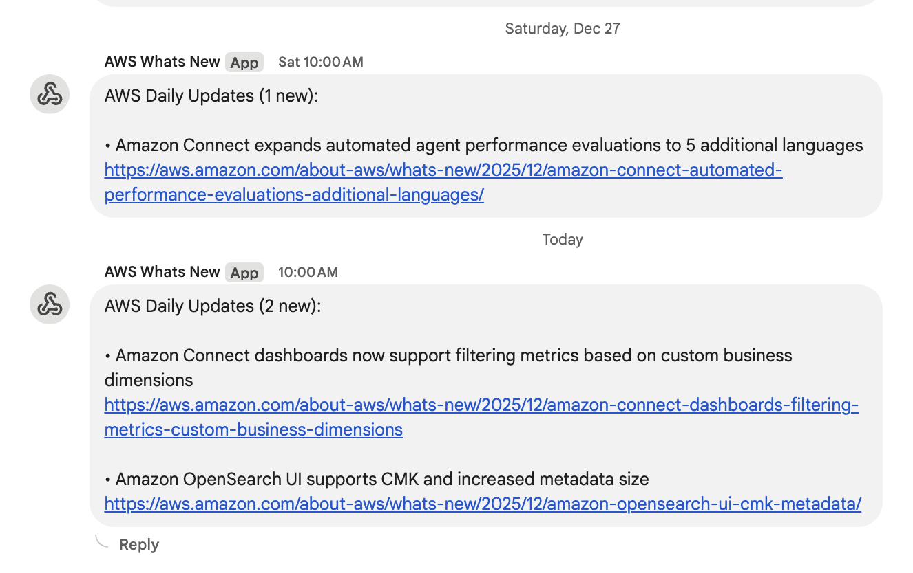

# AWS News Feed to Google Chat Notifier

A serverless AWS Lambda function that automatically fetches AWS news updates and sends daily notifications to Google Chat spaces.

## Overview

This solution monitors the AWS "What's New" RSS feed and sends a daily digest of new announcements to a Google Chat space. It filters updates from the last 24 hours and formats them for easy reading in chat.

## Features

- **Automated Daily Updates**: Fetches AWS news from the official RSS feed
- **Smart Filtering**: Only sends updates from the last 24 hours
- **Google Chat Integration**: Posts formatted messages to Google Chat spaces
- **Serverless Architecture**: Runs on AWS Lambda with minimal infrastructure
- **Error Handling**: Comprehensive logging and error management
- **Cost Effective**: Pay-per-execution model with minimal resource usage

## Architecture

```
CloudWatch Events (Daily Trigger) → AWS Lambda → Google Chat Webhook
                                        ↓
                                   AWS RSS Feed
```

## Google Chat Space webhook


## Prerequisites

- AWS Account with Lambda access
- Google Chat space with webhook configured
- Python 3.12+ runtime environment
- AWS CLI configured (for deployment)

## Setup Instructions

### 1. Google Chat Webhook Setup

1. Open Google Chat and navigate to your target space
2. Click on the space name → **Manage webhooks**
3. Click **Add webhook**
4. Provide a name (e.g., "AWS News Bot")
5. Copy the webhook URL (starts with `https://chat.googleapis.com/v1/spaces/`)

### 2. Deploy Lambda Function

#### Option A: Using AWS CLI
```bash
# Build deployment package
./build.sh

# Create Lambda function
aws lambda create-function \
  --function-name aws-news-notifier \
  --runtime python3.14 \
  --role arn:aws:iam::YOUR_ACCOUNT:role/lambda-execution-role \
  --handler lambda_function.lambda_handler \
  --zip-file fileb://lambda-deployment.zip \
  --environment Variables='{WEBHOOK_URL=YOUR_GOOGLE_CHAT_WEBHOOK_URL}'
```

#### Option B: Using AWS Console
1. Navigate to AWS Lambda console
2. Click **Create function**
3. Choose **Author from scratch**
4. Function name: `aws-news-notifier`
5. Runtime: **Python 3.14**
6. Upload the `lambda-deployment.zip` file
7. Set environment variable `WEBHOOK_URL` with your Google Chat webhook URL

### 3. Configure Scheduled Execution

#### Using EventBridge (CloudWatch Events)
```bash
# Create rule for daily execution at 9 AM UTC
aws events put-rule \
  --name aws-news-daily \
  --schedule-expression "cron(0 9 * * ? *)"

# Add Lambda as target
aws events put-targets \
  --rule aws-news-daily \
  --targets "Id"="1","Arn"="arn:aws:lambda:REGION:ACCOUNT:function:aws-news-notifier"

# Grant permission
aws lambda add-permission \
  --function-name aws-news-notifier \
  --statement-id aws-news-daily \
  --action lambda:InvokeFunction \
  --principal events.amazonaws.com \
  --source-arn arn:aws:events:REGION:ACCOUNT:rule/aws-news-daily
```

## Configuration

### Environment Variables

| Variable | Description | Required | Example |
|----------|-------------|----------|---------|
| `WEBHOOK_URL` | Google Chat webhook URL | Yes | `https://chat.googleapis.com/v1/spaces/...` |

### Lambda Configuration

- **Runtime**: Python 3.14
- **Memory**: 128 MB (minimum)
- **Timeout**: 30 seconds
- **Architecture**: x86_64

## Usage

### Manual Execution
```bash
# Test the function
aws lambda invoke \
  --function-name aws-news-notifier \
  --payload '{}' \
  response.json
```

### Scheduled Execution
The function runs automatically based on the configured EventBridge rule. Default schedule is daily at 9 AM UTC.

## Message Format

The Google Chat message includes:
- Number of new updates
- Bulleted list of update titles
- Direct links to each announcement

Example output:
```
AWS Daily Updates (3 new):

• Amazon EC2 now supports new instance types
https://aws.amazon.com/about-aws/whats-new/...

• AWS Lambda adds support for Python 3.11
https://aws.amazon.com/about-aws/whats-new/...
```

## Monitoring & Troubleshooting

### CloudWatch Logs
Monitor function execution in CloudWatch Logs:
- Log group: `/aws/lambda/aws-news-notifier`
- Check for parsing errors or webhook failures

### Common Issues

1. **No messages received**
   - Verify webhook URL is correct
   - Check Lambda execution logs
   - Ensure function has internet access

2. **SSL Certificate errors**
   - Function includes SSL context workaround
   - Check network connectivity

3. **Rate limiting**
   - AWS RSS feed has built-in rate limiting
   - Function includes appropriate delays

## Cost Estimation

- **Lambda**: ~$0.01/month (daily execution)
- **CloudWatch Logs**: ~$0.50/month (standard retention)
- **EventBridge**: Free tier covers daily triggers

Total estimated cost: **< $1/month**

## Security Considerations

- Store webhook URL as environment variable (encrypted at rest)
- Use least privilege IAM role
- Enable CloudTrail for audit logging
- Consider VPC deployment for enhanced security

## Development

### Local Testing
```bash
# Install dependencies
pip install -r requirements.txt

# Set environment variable
export WEBHOOK_URL="your_webhook_url"

# Run locally
python lambda_function.py
```

### Customization Options

- **Frequency**: Modify EventBridge schedule expression
- **Content Filtering**: Add keyword filters in lambda_function.py
- **Message Format**: Customize message template
- **Multiple Channels**: Add support for multiple webhook URLs

## Contributing

1. Fork the repository
2. Create feature branch
3. Test changes locally
4. Submit pull request with description

## License

MIT License - see LICENSE file for details

## Support

For issues and questions:
- Check CloudWatch logs for errors
- Review AWS Lambda documentation
- Open GitHub issue with error details